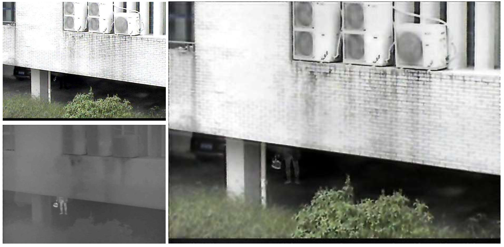

# Visible and infrared image fusion model based on NSCT-HRCNN

## Introduction
This project introduces an image fusion algorithm, NSCT-HRCNN, designed to effectively merge infrared and visible light images, capturing distinct environmental features from both modalities into a single, comprehensive image. Image fusion is crucial for fully representing these features, but traditional algorithms often suffer from low precision, color distortion, and detail loss. While deep learning-based methods can address these issues, they tend to be computationally intensive.

To overcome these challenges, our approach leverages the Non-Subsampled Contourlet Transform (NSCT) combined with a Hierarchical Random-Coupled Neural Network (HRCNN). This method offers the computational efficiency of traditional techniques while avoiding extensive neural network training. By integrating hierarchical features, the NSCT-HRCNN algorithm addresses common drawbacks such as artifacts and color distortion, preserving the natural color information from visible light images and incorporating clear details from infrared images. Comparative experiments on the VIFB dataset demonstrate that NSCT-HRCNN significantly outperforms state-of-the-art methodologies.


If you find our work useful in your research or publication, please cite our work:

Haoran Liu, Yiran Chen, Peng Li, Mingzhe Liu* "Infrared and Visible Image Fusion based on NSCT and Hierarchical Random-Coupled Neural Network." Not published yet.

## Dependencies

*	MATLAB2024b version is recommended
*   **`Fusion` Folder:** This folder must be in the MATLAB path and contain the `fusion_main` function, which performs the core image fusion operation.
*   **`Genetic-Algorithm` Folder:** This folder must be in the MATLAB path and contain the `GA_Main` function, which is used for genetic algorithm-based parameter optimization when `flag` is set to `1`.


## How to use

Run the demo.m file to perform IR and VI image fusion on a directory of images. The resulting fused images will then be generated.
1.  **Unzip:** Unzip it after downloading.
2.  **Prepare Input Images:** Load your visible (`imgVI`) and infrared (`imgIR`) images into MATLAB as `uint8` or `double` arrays.  Ensure they are properly registered (aligned).
3.  **Set Visualization Flag:** Decide whether you want to visualize the images during the fusion process. Set `visualization` to `1` to display the images or `0` to suppress display.
4.  **Set Parameter Selection Flag:** Choose whether to use the genetic algorithm to optimize parameters or use the default parameters. Set `flag` to `1` to use the genetic algorithm or `0` to use the default parameters.
5.  **Call the Function:** Call the `run_RCNN` function with the appropriate input arguments:
        
    ```
    fusedImage = run_RCNN(visibleImage, infraredImage, 1, 1);
6.  **Display or Save the Fused Image:**  Display the resulting fused image using `imshow(fusedImage)` or save it to a file using `imwrite(fusedImage, 'fused_image.png')`.

### Example
MATLAB
   ```
% Load the visible and infrared images (replace with your actual file paths)
visibleImage = imread('visible_image.jpg');
infraredImage = imread('infrared_image.png');

% Run the RCNN fusion with visualization and genetic algorithm parameter optimization
fusedImage = run_RCNN(visibleImage, infraredImage, 1, 1);

% Display the fused image
imshow(fusedImage);

% Save the fused image
imwrite(fusedImage, 'fused_image.png');
   ```
## Dataset and Model Results

This application will open source test results and source code, which you can download here:

[]()
